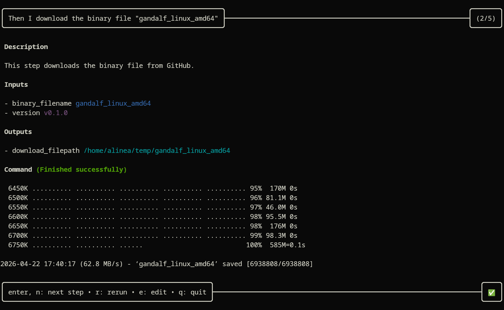
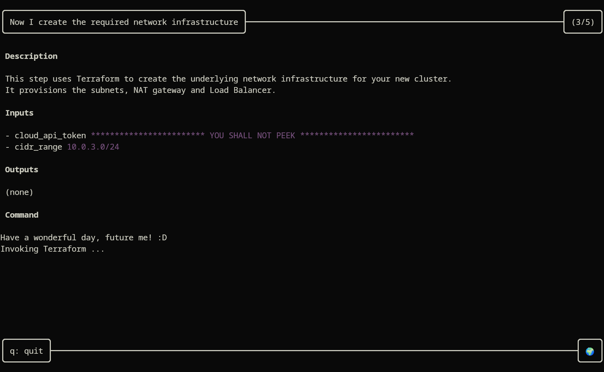
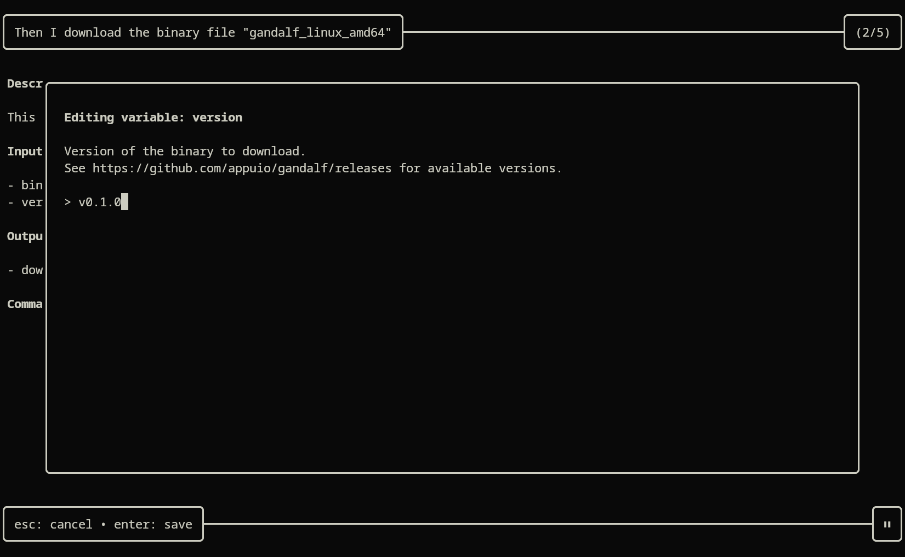

# APPUiO Gandalf

Gandalf is a tool to create wizard-like guided automation workflows, presented in a nice TUI.
It sits right in the middle between having a long-winded playbook document for performing a process manually, and using a fully-fledged declarative "X-as-code" thing like Terraform or Ansible.

## Highlights

- Easily turn manual procedures into semi-automated workflows
- Beautiful TUI interface that guides you through the steps
- Parameter values are remembered for you, so you can pick up where you left off with ease
- An easy and straightforward 80% solution for cases where full automation is not feasible

## Overview



With Gandalf, manual processes can be partially automated very quickly.
If full "proper" automation is not feasible for whatever reason (for example, if some steps require human intervention), then Gandalf provides the middle ground to at least save some of the time you'd otherwise waste following a manual procedure.

Gandalf uses a *procedural* approach to automation, rather than a *declarative* approach.
While the declarative approach has many advantages and is often preferred, the procedural approach was chosen here for one main reason:
If you're working from a pre-existing manual procedure, adapting this to a procedural style of automation is quick and straight-forward.
Since full automation is already deemed infeasible (otherwise you should choose that over Gandalf), ease of implementation is a great benefit.
Gandalf aims to be the quick, 80% solution to automation, for when a 100% solution just can't be attained.

Simply break your manual procedure into smaller semantic steps, which are all either automat-able or require human intervention.
Write a Gandalf *spell* for each of these steps.
Automate those parts that can be automated, and write instructions for humans where automation is not easily possible.
Combine all the spells you made into a complete *workflow*, which can be executed step-by-step with Gandalf.

Every part that can be automated now runs autonomously.
And for those parts that can't be, your instructions are presented, and Gandalf waits for the user to confirm the work is done.

Gandalf remembers where you are in your workflow, and stores any parameters in a local state file.
This allows you to stop a workflow at any point, and later on, pick up where you left off.

 

## Usage

At the core of a Gandalf guided automation is the workflow file.
It defines, at a high level, which steps need to be performed in order to achieve your goal.

*install.workflow*
```
Given I have all the dependencies installed
Then I download the binary file "gandalf_linux_amd64"
And I install it in the appropriate location
```

Each line of a workflow is a reference to a *spell*, a unit of work Gandalf can perform.
These spells are defined in one or multiple *spellbooks*, which contain all the information to run the spell.

Here's what an example spellbook might look like:

*spells.yml*
```yaml
spells:
- match: Given I have all the dependencies installed
  description: This spell checks whether the system it's running on has all necessary dependencies installed.
  run: |
    set -euo pipefail
    which bash
    which wget
- match: Then I download the binary file "(?P<binary_filename>[^"]+)"
  description: This step downloads the binary file from GitHub.
  inputs:
  - name: version
    description: |-
      Version of the binary to download.
      See https://github.com/appuio/gandalf/releases for available versions.
  outputs:
  - name: download_filepath
    description: Path to which the binary was downloaded.
  run: |
    set -euo pipefail
    wget "https://github.com/appuio/gandalf/releases/download/${INPUT_version}/${MATCH_binary_filename}"
    env -i "download_filepath=$( pwd )/${MATCH_binary_filename}" >> "$OUTPUT"
- match: And I install it in the appropriate location
  description: This step moves the downloaded binary from {{ .download_filepath }} to the correct location on the system.
  inputs:
  - name: download_filepath
  - name: install_path
    description: |-
      Full path of the directory in which you would like to install the binary.
  run: |
    set -euo pipefail
    mv ${INPUT_download_filepath} ${INPUT_install_path}/gandalf
```

To run the workflow above with this spellbook, gandalf is invoked with the `run` subcommand:

```bash
gandalf run ./install.workflow ./spells.yml
```

It is possible to provide more than one spellbook.
All provided spellbooks will be searched for matches to a given workflow step.

```bash
gandalf run ./install.workflow ./spells.yml ./additional-spells.yml
```
> [!NOTE]
> Gandalf stores its state in the local directory, and spells may freely create files in the local directory.
> It is therefore recommended to run Gandalf in an empty directory to avoid polluting your file system.

A TUI will guide the user through the various spells that are part of this workflow.
The workflow can be interrupted at any time, and can be seamlessly restarted at the start of the last spell that was running.
All inputs and outputs are remembered.

### Structure of a spellbook

As you can see in the example above, the spellbook is a yaml file, which contains a single root key `.spells`.
`.spells` then contains a list of Spell objects, which have the following properties:

- `match` (string, required): Regular expression which will be matched against entries in a workflow file; if the regexp matches, then this is the spell to be run for that particular workflow step. Named matches can serve as parameters; the matched value is made available to the script.
- `description` (string, optional): Human-readable description of what this spell does. Can use Go templating to render inputs or outputs from spells that have already run.
- `inputs` (Input, optional): List of Inputs, which represent the parameters this spell requires
- `outputs` (Output, optional): List of Outputs, which represent the values this spell produces
- `run` (string, optional): Bash script that is run when this spell is invoked

An Input or Output can have the following properties (both types are currently equivalent):
- `name` (string, required): Name of this input or output parameter
- `description` (string, optional): Description of this input or output; presented to the user when they are asked to provide a value. Unused for outputs.
- `type` (enum, optional, defaults to "regular"): one of "regular", "local", "sensitive", or "local-sensitive"
  - `regular` parameters are not treated specially: they are stored in the state, and shown in the UI. This is the default behaviour if no type is specified.
  - `local` parameters are not stored in the state. This is useful for parameters that need to change depending on who is running a workflow, such as personal access tokens.
  - `sensitive` parameters are hidden in the UI. This is useful for secrets like access tokens or passwords.
  - `local-sensitive` combines the properties of `local` and `sensitive`.

The script that is provided in the `run` property is executed in the `bash` shell, and is provided with the following environment:
- For each input defined in the spell, the environment variable `INPUT_<name>` is set, where `<name>` is the name of the input and the input's value is provided as the environment variable's value.
- The environment variable `GANDALF_SPELLBOOK_DIR` contains the directory in which the spellbook resides. This always refers to the spellbook of which the current spell is a part, even if multiple spellbooks are provided when running Gandalf.
- The environment variable `OUTPUT` points to the file in which the script is to store its outputs.

To provide outputs back to Gandalf, the script is to store each output parameter as a key-value pair in the file residing at `$OUTPUT`, in the format `output_name=value`.
We recommend using the `env` utility to do this:

```bash
env -i "output_name=value_of_my_output" >> "$OUTPUT"
```
### Structure of the Gandalf state file

When you invoke Gandalf, it will create a file `.gandalf-state.json` in the local directory.
This file stores the values of all parameters (inputs and outputs) that are part of your workflow, as well as the current step being executed.

*.gandalf_state.json*
```json
{
	"current_step": "And I install it in the appropriate location",
	"completed_steps": [
		"Given I have all the dependencies installed",
		"Then I download the binary file \"gandalf_linux_amd64\""
	],
	"outputs": {
		"version": {
			"value": "v0.1.0"
		},
		"download_filepath": {
			"value": "~/temp/gandalf_linux_amd64"
		},
		"install_path": {
			"value": "~/.local/bin"
		}
	},
	"artifacts": {}
}
```
This json file has the following structure:
- `current_step`: Name of the step at which the workflow was last left off. This corresponds to a line in the workflow file.
- `completed_steps`: List of all steps which have previously been completed. This list is not used, and exists for human reference and debugging purposes.
- `outputs`: Dictionary containing all parameters (inputs as well as outputs) that were defined over the course of the workflow run so far.
- `artifacts`: Currently unused.

The state file is read when Gandalf starts, and is written every time Gandalf transitions to the next step, and when Gandalf exits.

## Installation

**The quickest way** to get Gandalf is to head to the [Releases](https://github.com/appuio/gandalf/releases/) page and download the binary for whichever version you like.
You can then run it just like the examples above.

We additionally provide a Docker image for Gandalf:
```bash
docker pull ghcr.io/appuio/guided-setup:latest
```

However, due to Gandalf's reliance on storing state on your local disk, using Gandalf in Docker requires additional volume mounts to work properly.
In addition, most Gandalf spells will come with various dependencies (for the various command line tools you'll want to use in your bash scripts), and those are not included in the Gandalf docker container.
If you have a sufficiently complex workflow and would like to distribute this via Docker, our recommendation is to build your own Dockerfile specific to that workflow, make sure it includes all dependencies you need, and provide that to anyone who would want to run your workflow.

An example of such a setup can be found in our [Guided Cluster Setup](https://github.com/appuio/guided-setup) workflow, where we provide a [bespoke Dockerfile](https://github.com/appuio/guided-setup/blob/main/Dockerfile) as well as a [sophisticated shell alias](https://github.com/appuio/guided-setup/blob/main/docker/aliases.sh) that takes care of setting up all necessary volume mounts to make this work.
